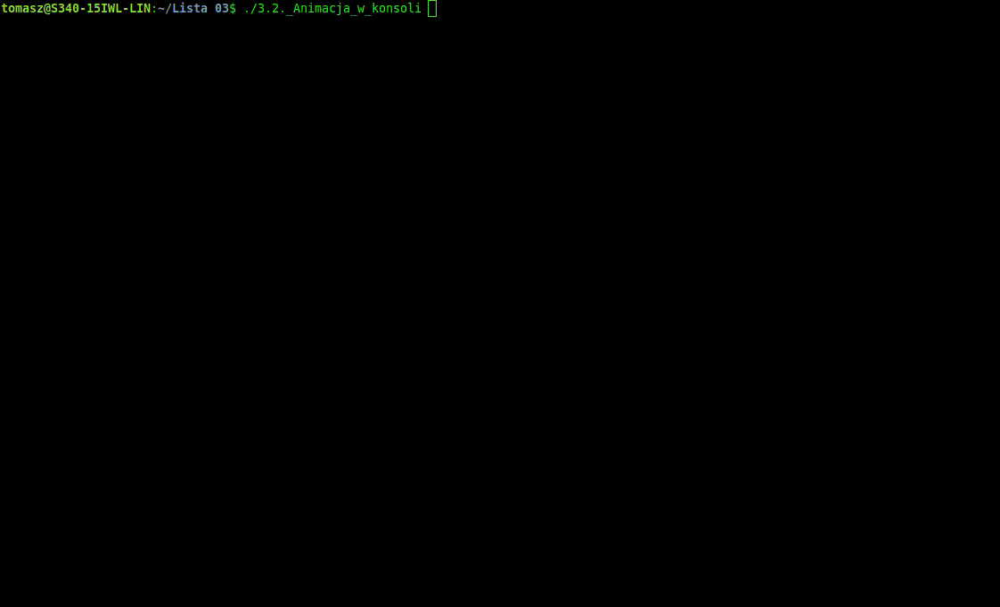
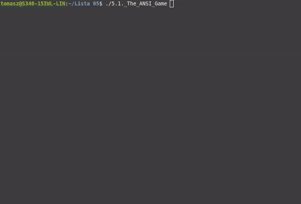
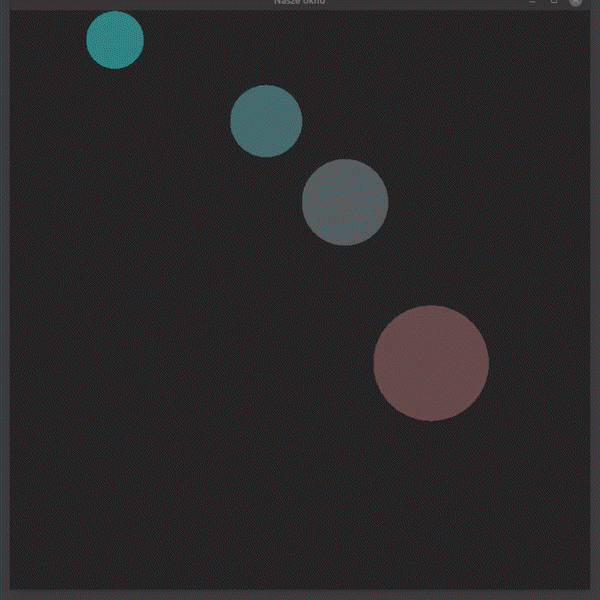
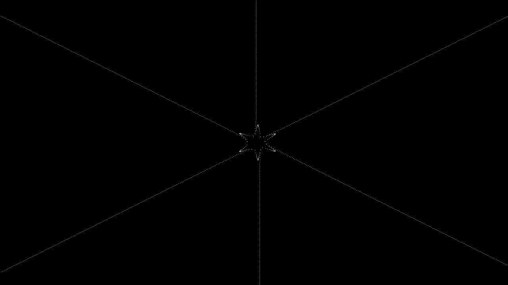
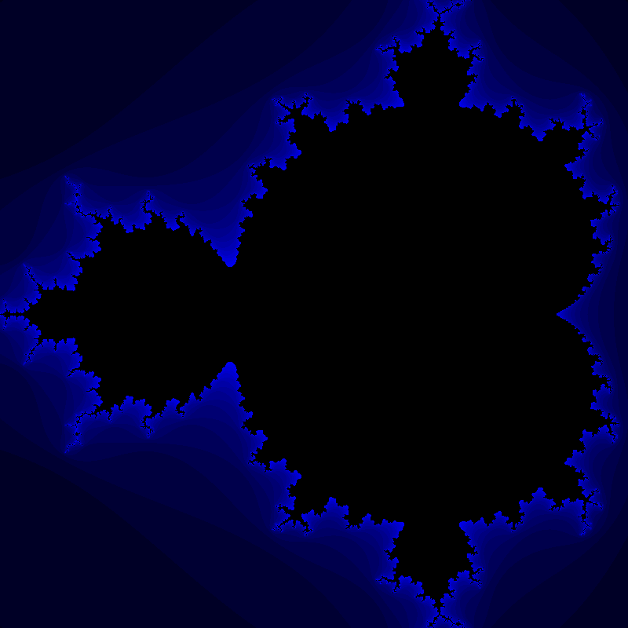

# UNI-Introduction-to-Programming

This repository contains 10 completed exercise sheets from **"Practical introduction to programming"** course from University of Wrocław.  

Even though this course was intended for first semester students of Applied Computer Science, some of the exercise sheets were very challenging.  
All of the sheets were designed to teach us C++, and I enjoyed all of them: from learning basic conditions and loops, through ANSI encoding, gnuplot data generation, up to SFML physics, animation and game creation!  

Below you can find my _cherry-picks_ - the exercises/projects that I fancied and am proud of the most:  
- [3.2._Animacja_w_konsoli.cpp - Matrix digital rain](https://github.com/tTargiel/UNI-Introduction-to-Programming/blob/main/Lista%2003/3.2._Animacja_w_konsoli.cpp)  
  

- [5.1._The_ANSI_Game.cpp - Familiada TV game show](https://github.com/tTargiel/UNI-Introduction-to-Programming/blob/main/Lista%2005/5.1._The_ANSI_Game.cpp)  
  

- [7.1._Ruchy.cpp - Bouncy balls animation](https://github.com/tTargiel/UNI-Introduction-to-Programming/blob/main/Lista%2007/7.1._Ruchy.cpp)  
  

- [Space_Cow.cpp - Game about cow in space](https://github.com/tTargiel/UNI-Introduction-to-Programming/blob/main/Lista%2008/Space_Cow.cpp)  
  

- [9.3._Pixar.cpp - Mathematically dictated animation](https://github.com/tTargiel/UNI-Introduction-to-Programming/blob/main/Lista%2009/9.3._Pixar.cpp)  
  

- [D.1._Zbior_Mandelbrota.cpp - Mandelbrot set render](https://github.com/tTargiel/UNI-Introduction-to-Programming/blob/main/Lista%2010/D.1._Zbior_Mandelbrota.cpp)  
  
